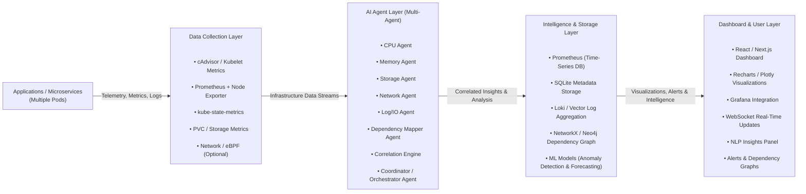

# PodSage AI

AI-Powered Kubernetes Observability & Infrastructure Intelligence Platform

---

## Overview

PodSage AI is an intelligent Kubernetes observability platform designed to monitor, analyze, and correlate real-time pod resource behavior using AI-driven infrastructure insights.

Built for the ABB Accelerator 2026 challenge, the platform helps engineers detect anomalies, understand service dependencies, and optimize containerized environments through real-time analytics, anomaly detection, and intelligent recommendations.

The platform combines Kubernetes telemetry, Prometheus metrics, AI-driven analysis, and real-time dashboards into a unified infrastructure intelligence system.

---

# Organisation

**Organisation Display Name:** PodSage AI
**GitHub Organization:** `PodSageAI`

---

## Key Features

* Real-time Kubernetes monitoring
* CPU, memory, and restart analytics
* AI-powered anomaly detection
* Infrastructure intelligence & recommendations
* Pod dependency mapping
* Prometheus integration
* WebSocket live updates
* Dockerized deployment
* Kubernetes-compatible architecture
* Extensible AI agent framework
* Fault-tolerant metric fallback handling
* Node-level fallback monitoring
* Lightweight FastAPI backend
* AI insights generation engine

---

# System Architecture



---

# Tech Stack

## Backend

* Python 3.11
* FastAPI
* Uvicorn
* WebSockets
* SQLite

## Monitoring & Metrics

* Prometheus
* Node Exporter
* Kubernetes Metrics API
* cAdvisor

## Infrastructure

* Docker
* Docker Compose
* Kubernetes
* Minikube
* K3s
* MicroK8s

## AI & Analysis

* Rule-based anomaly detection
* Infrastructure correlation engine
* Dependency analysis
* Forecast-ready architecture

## Frontend (Planned)

* React / Next.js
* Recharts
* Plotly
* Grafana

---

# Project Structure

```text
PodSage-AI/
├── LICENSE
├── README.md
├── backend/
│   ├── Dockerfile
│   ├── docker-compose.yml
│   ├── prometheus.yml
│   ├── requirements.txt
│   ├── podsage.db
│   │
│   └── app/
│       ├── api/
│       │   ├── anomalies.py
│       │   ├── dependencies.py
│       │   ├── insights.py
│       │   ├── metrics.py
│       │   └── __init__.py
│       │
│       ├── database/
│       │   ├── db.py
│       │   └── __init__.py
│       │
│       ├── models/
│       │   ├── schemas.py
│       │   └── __init__.py
│       │
│       ├── services/
│       │   ├── ai_service.py
│       │   ├── alert_service.py
│       │   ├── dependency_service.py
│       │   ├── kubernetes_service.py
│       │   ├── prometheus_service.py
│       │   └── __init__.py
│       │
│       ├── websocket/
│       │   ├── live_updates.py
│       │   └── __init__.py
│       │
│       ├── __init__.py
│       └── main.py
│
└── .gitignore
```

---

# API Endpoints

## Health Endpoints

| Endpoint  | Description          |
| --------- | -------------------- |
| `/`       | Root status endpoint |
| `/health` | Health check         |

---

## Metrics Endpoints

| Endpoint            | Description          |
| ------------------- | -------------------- |
| `/metrics/cpu`      | CPU usage metrics    |
| `/metrics/memory`   | Memory usage metrics |
| `/metrics/restarts` | Pod restart metrics  |

---

## AI & Intelligence Endpoints

| Endpoint        | Description                       |
| --------------- | --------------------------------- |
| `/anomalies`    | Detected anomalies                |
| `/insights`     | AI-generated operational insights |
| `/dependencies` | Service dependency map            |

---

# Example Responses

## Root Endpoint

```json
{
  "message": "PodSage AI Backend Running",
  "status": "healthy",
  "version": "v0.1.3-alpha"
}
```

---

## CPU Metrics

```json
{
  "status": "success",
  "data": {
    "resultType": "vector",
    "result": [
      {
        "metric": {},
        "value": [
          1778683850.411,
          "0.2482235237555631"
        ]
      }
    ]
  }
}
```

---

## Anomaly Detection

```json
[
  {
    "type": "High CPU Usage",
    "pod": "node-exporter:9100",
    "value": 24.82,
    "unit": "%"
  }
]
```

---

## AI Insights

```json
[
  {
    "pod": "node-exporter:9100",
    "insight": "Pod node-exporter:9100 is consuming unusually high CPU resources.",
    "recommendation": "Consider scaling replicas or optimizing workload."
  }
]
```

---

# Installation

## Clone Repository

```bash
git clone https://github.com/PodSageAI/PodSage-AI.git
cd PodSage-AI/backend
```

---

## Install Dependencies

```bash
pip install -r requirements.txt
```

---

# Running the Backend

## Local Development

```bash
uvicorn app.main:app --reload
```

Backend URL:

```text
http://localhost:8000
```

Swagger Docs:

```text
http://localhost:8000/docs
```

---

# Docker Usage

## Start Services

```bash
docker compose up --build
```

---

## Stop Services

```bash
docker compose down
```

---

# Docker Services

| Service       | Port | Description                |
| ------------- | ---- | -------------------------- |
| Backend       | 8000 | FastAPI backend            |
| Prometheus    | 9090 | Metrics database           |
| Node Exporter | 9100 | Host/node metrics exporter |

---

# Prometheus Integration

PodSage AI supports:

* Prometheus metrics
* Node Exporter metrics
* Kubernetes metrics
* Container metrics
* Node-level fallback monitoring

The backend automatically falls back to node metrics when container-level metrics are unavailable.

Example fallback query:

```promql
1 - avg(rate(node_cpu_seconds_total{mode="idle"}[1m]))
```

---

# AI Anomaly Detection

The AI engine currently supports:

* High CPU usage detection
* High memory usage detection
* Frequent restart detection

Default thresholds:

```python
CPU_THRESHOLD = 0.2
MEMORY_THRESHOLD = 500000000
RESTART_THRESHOLD = 5
```

---

# Current Capabilities

* Live CPU monitoring
* Memory monitoring
* Pod restart tracking
* AI anomaly detection
* Infrastructure insights
* Dependency mapping
* Prometheus querying
* Real-time backend APIs
* Fault-tolerant Prometheus fallback handling

---

# Planned Features

* LLM-powered operational intelligence
* NLP querying
* Historical anomaly analytics
* Predictive forecasting
* Real dependency graph visualization
* Grafana dashboard integration
* Multi-node Kubernetes support
* eBPF network dependency tracing
* Advanced ML anomaly scoring
* Distributed cluster analytics
* Intelligent auto-remediation
* AI-based infrastructure forecasting

---

# ABB Accelerator 2026

Developed as part of the ABB Accelerator 2026 innovation challenge focused on:

* AI-powered infrastructure intelligence
* Kubernetes observability
* Real-time analytics
* Automation & monitoring
* Cloud-native operational systems

---

# License

MIT License

Copyright (c) 2026 PodSage AI

---

# Maintainers

* Abhrankan Chakrabarti
* PodSage AI Team

---

# Status

Current Version:

```text
v0.1.3-alpha
```

Project Status:

```text
Active Development
```
