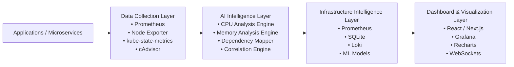

# 🧠 PodSage AI

<p align="center">
  
  
  
  
</p>

<p align="center">
  
  
  
  
</p>

<p align="center">
  <b>AI-Powered Kubernetes Observability & Infrastructure Intelligence</b>
</p>

<p align="center">
  Real-time telemetry • AI-driven anomaly detection • Operational intelligence
</p>

---

# 📖 Overview

PodSage AI is an intelligent Kubernetes observability platform that monitors, analyzes, and correlates real-time infrastructure behavior using AI-powered operational insights.

Built for the **ABB Accelerator 2026** challenge, PodSage AI combines Kubernetes telemetry, Prometheus metrics, anomaly detection, dependency analysis, and infrastructure intelligence into a unified monitoring ecosystem.

The mission is simple:

> Transform raw Kubernetes metrics into actionable operational intelligence.

---

# ❓ Why PodSage AI?

Traditional observability platforms expose metrics.

PodSage AI focuses on transforming telemetry into actionable operational intelligence using AI-assisted infrastructure analysis.

Instead of only showing dashboards, PodSage AI helps explain:

* why infrastructure issues happen
* which services are affected
* how anomalies correlate
* what actions engineers should take

---

# ✨ Core Features

* 📡 Real-time Kubernetes monitoring
* 🧠 AI-powered anomaly detection
* 🔥 Infrastructure intelligence engine
* 📈 CPU, memory & restart analytics
* 🔗 Pod dependency mapping
* ⚡ WebSocket live updates
* 📊 Prometheus integration
* 🐳 Dockerized deployment
* ☸️ Kubernetes-native architecture
* 🧩 Modular AI service architecture
* 🛡️ Fault-tolerant metric fallback handling
* 🚀 Lightweight FastAPI backend

---

# 🏗️ System Architecture



---

# ⚙️ Tech Stack

## Backend

* Python 3.11
* FastAPI
* Uvicorn
* WebSockets
* SQLite

## Monitoring & Metrics

* Prometheus
* Node Exporter
* Kubernetes Metrics API
* cAdvisor

## Infrastructure

* Docker
* Docker Compose
* Kubernetes
* Minikube
* K3s
* MicroK8s

## AI & Analysis

* AI-assisted anomaly detection
* Infrastructure correlation engine
* Forecast-ready analytics architecture
* Operational intelligence pipeline

## Frontend (Planned)

* React / Next.js
* Recharts
* Plotly
* Grafana

---

# 📁 Project Structure

```text
PodSage-AI/
├── backend/
│   ├── app/
│   │   ├── api/
│   │   ├── database/
│   │   ├── models/
│   │   ├── services/
│   │   ├── websocket/
│   │   └── main.py
│   │
│   ├── Dockerfile
│   ├── docker-compose.yml
│   ├── prometheus.yml
│   ├── requirements.txt
│   └── podsage.db
│
├── README.md
├── LICENSE
└── .gitignore
```

---

# 🚀 Getting Started

## Prerequisites

Before starting, ensure you have:

* Python 3.11+
* Docker & Docker Compose
* Kubernetes cluster (optional but recommended)
* Prometheus installed or accessible

---

# 📦 Installation

## 1. Clone Repository

```bash
git clone https://github.com/PodSageAI/PodSage-AI.git
cd PodSage-AI/backend
```

---

## 2. Create Virtual Environment

```bash
python -m venv venv
```

### Linux / macOS

```bash
source venv/bin/activate
```

### Windows

```powershell
venv\Scripts\activate
```

---

## 3. Install Dependencies

```bash
pip install -r requirements.txt
```

---

# ▶️ Running the Backend

## Local Development

```bash
uvicorn app.main:app --reload
```

Backend URL:

```text
http://localhost:8000
```

Swagger Documentation:

```text
http://localhost:8000/docs
```

ReDoc Documentation:

```text
http://localhost:8000/redoc
```

---

# 🎥 Demo

## Live Metrics API

```bash
curl http://localhost:8000/metrics/cpu
```

## Open Swagger UI

```text
http://localhost:8000/docs
```

---

# 🐳 Docker Usage

## Start Services

```bash
docker compose up --build
```

## Stop Services

```bash
docker compose down
```

## Run in Detached Mode

```bash
docker compose up -d
```

---

# ☸️ Kubernetes Deployment

## Apply Kubernetes Resources

```bash
kubectl apply -f k8s/
```

## Verify Pods

```bash
kubectl get pods
```

## Port Forward Backend

```bash
kubectl port-forward svc/podsage-ai 8000:8000
```

---

# 📡 API Endpoints

## Health Endpoints

| Endpoint  | Description  |
| --------- | ------------ |
| `/`       | Root status  |
| `/health` | Health check |

---

## Metrics Endpoints

| Endpoint            | Description     |
| ------------------- | --------------- |
| `/metrics/cpu`      | CPU metrics     |
| `/metrics/memory`   | Memory metrics  |
| `/metrics/restarts` | Restart metrics |

---

## AI & Intelligence Endpoints

| Endpoint        | Description           |
| --------------- | --------------------- |
| `/anomalies`    | Detected anomalies    |
| `/insights`     | AI-generated insights |
| `/dependencies` | Dependency mapping    |

---

# 📘 Example API Responses

## CPU Metrics

```json
{
  "status": "success",
  "data": {
    "resultType": "vector",
    "result": [
      {
        "metric": {},
        "value": [
          1778683850.411,
          "0.2482235237555631"
        ]
      }
    ]
  }
}
```

---

## Anomaly Detection

```json
[
  {
    "type": "High CPU Usage",
    "pod": "node-exporter:9100",
    "value": 24.82,
    "unit": "%"
  }
]
```

---

## AI Insights

```json
[
  {
    "pod": "node-exporter:9100",
    "insight": "Pod node-exporter:9100 is consuming unusually high CPU resources.",
    "recommendation": "Consider scaling replicas or optimizing workload."
  }
]
```

---

# 🧠 AI Capabilities

Current AI functionality includes:

* High CPU usage detection
* High memory usage detection
* Restart anomaly detection
* Infrastructure correlation
* Dependency intelligence

## Default Thresholds

```python
CPU_THRESHOLD = 0.2
MEMORY_THRESHOLD = 500000000
RESTART_THRESHOLD = 5
```

---

# 🛡️ Fault-Tolerant Monitoring

PodSage AI automatically falls back to node-level metrics when container-level Kubernetes metrics are unavailable.

This ensures monitoring continuity even in partially configured environments.

Example fallback query:

```promql
1 - avg(rate(node_cpu_seconds_total{mode="idle"}[1m]))
```

---

# 📊 Observability Workflow

1. Kubernetes metrics are scraped via Prometheus
2. Metrics are processed by intelligence services
3. Infrastructure anomalies are detected
4. Correlation engine generates operational insights
5. Real-time updates stream through WebSockets
6. Dashboards visualize cluster intelligence

---

# ✅ Current Capabilities

* Live CPU monitoring
* Memory monitoring
* Pod restart tracking
* AI anomaly detection
* Infrastructure insights
* Dependency mapping
* Prometheus querying
* Real-time backend APIs
* Node-level fallback monitoring

---

# 🧪 Example Use Cases

* Detect abnormal pod CPU spikes
* Identify memory leaks across services
* Correlate pod restart storms
* Monitor Kubernetes cluster health
* Analyze infrastructure dependencies
* Stream live telemetry dashboards

---

# 🛣️ Roadmap

* 🤖 LLM-powered operational intelligence
* 📚 NLP infrastructure querying
* 📈 Predictive forecasting
* 🔗 Advanced dependency graph visualization
* 🧠 ML-based anomaly scoring
* 🌐 Multi-cluster observability
* ⚡ Intelligent auto-remediation
* 🛰️ eBPF network tracing

---

# 🏆 ABB Accelerator 2026

PodSage AI was developed as part of the **ABB Accelerator 2026** innovation challenge focused on:

* AI-powered infrastructure intelligence
* Kubernetes observability
* Cloud-native analytics
* Operational automation

---

# 🤝 Contributing

Contributions are welcome.

## Steps to Contribute

### 1. Fork the Repository

### 2. Create a Feature Branch

```bash
git checkout -b feature/my-feature
```

### 3. Commit Changes

```bash
git commit -m "Add new feature"
```

### 4. Push to Branch

```bash
git push origin feature/my-feature
```

### 5. Open a Pull Request

---

# 👥 Maintainers

* Abhrankan Chakrabarti
* PodSage AI Team

---

# 📄 License

MIT License © 2026 PodSage AI

---

# 📌 Project Status

```text
Version: v0.1.3-alpha
Status: Active Development
```

---

# 🌟 Vision

PodSage AI aims to evolve into a next-generation autonomous infrastructure intelligence platform capable of understanding, predicting, and optimizing Kubernetes environments in real time.

Future versions aim to transition from observability into fully autonomous operational intelligence.

---

<p align="center">
  Built with ❤️ for cloud-native infrastructure intelligence
</p>
