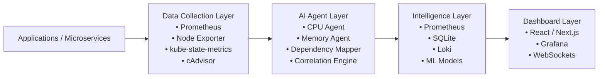

# 🧠 PodSage AI

<p align="center">
  <b>AI-Powered Kubernetes Observability & Infrastructure Intelligence</b>
</p>

<p align="center">
  Real-time telemetry • AI-driven anomaly detection • Infrastructure intelligence
</p>

---

## Overview

PodSage AI is an intelligent Kubernetes observability platform designed to monitor, analyze, and correlate real-time infrastructure behavior using AI-powered operational insights.

Built for the **ABB Accelerator 2026** challenge, the platform combines Kubernetes telemetry, Prometheus metrics, anomaly detection, dependency analysis, and infrastructure intelligence into a unified monitoring ecosystem.

The goal is simple:

> Transform raw Kubernetes metrics into actionable operational intelligence.

---

## ✨ Core Features

- 📡 Real-time Kubernetes monitoring
- 🧠 AI-powered anomaly detection
- 🔥 Infrastructure intelligence engine
- 📈 CPU, memory & restart analytics
- 🔗 Pod dependency mapping
- ⚡ WebSocket live updates
- 📊 Prometheus integration
- 🐳 Dockerized deployment
- ☸️ Kubernetes-native architecture
- 🧩 Modular AI agent framework
- 🛡️ Fault-tolerant metric fallback handling
- 🚀 Lightweight FastAPI backend

---

# 🏗️ System Architecture



---

# ⚙️ Tech Stack

## Backend
- Python 3.11
- FastAPI
- Uvicorn
- WebSockets
- SQLite

## Monitoring & Metrics
- Prometheus
- Node Exporter
- Kubernetes Metrics API
- cAdvisor

## Infrastructure
- Docker
- Docker Compose
- Kubernetes
- Minikube
- K3s
- MicroK8s

## AI & Analysis
- Rule-based anomaly detection
- Infrastructure correlation engine
- Forecast-ready architecture

## Frontend (Planned)
- React / Next.js
- Recharts
- Plotly
- Grafana

---

# 📁 Project Structure

```text
PodSage-AI/
├── backend/
│   ├── app/
│   ├── Dockerfile
│   ├── docker-compose.yml
│   ├── prometheus.yml
│   └── requirements.txt
├── README.md
└── LICENSE
```

---

# 🚀 Installation

## Clone Repository

```bash
git clone https://github.com/PodSageAI/PodSage-AI.git
cd PodSage-AI/backend
```

## Install Dependencies

```bash
pip install -r requirements.txt
```

---

# ▶️ Running the Backend

## Local Development

```bash
uvicorn app.main:app --reload
```

Backend:

```text
http://localhost:8000
```

Swagger Docs:

```text
http://localhost:8000/docs
```

---

# 🐳 Docker Usage

## Start Services

```bash
docker compose up --build
```

## Stop Services

```bash
docker compose down
```

---

# 📡 API Endpoints

## Health

| Endpoint | Description |
|---|---|
| `/` | Root status |
| `/health` | Health check |

## Metrics

| Endpoint | Description |
|---|---|
| `/metrics/cpu` | CPU metrics |
| `/metrics/memory` | Memory metrics |
| `/metrics/restarts` | Restart metrics |

## AI & Intelligence

| Endpoint | Description |
|---|---|
| `/anomalies` | Detected anomalies |
| `/insights` | AI-generated insights |
| `/dependencies` | Dependency mapping |

---

# 🧠 AI Capabilities

Current AI functionality includes:

- High CPU usage detection
- High memory usage detection
- Restart anomaly detection
- Infrastructure correlation
- Dependency intelligence

Default thresholds:

```python
CPU_THRESHOLD = 0.2
MEMORY_THRESHOLD = 500000000
RESTART_THRESHOLD = 5
```

---

# 🛣️ Roadmap

- 🤖 LLM-powered operational intelligence
- 📚 NLP infrastructure querying
- 📈 Predictive forecasting
- 🔗 Advanced dependency graph visualization
- 🧠 ML-based anomaly scoring
- 🌐 Multi-cluster observability
- ⚡ Intelligent auto-remediation
- 🛰️ eBPF network tracing

---

# 🏆 ABB Accelerator 2026

PodSage AI was developed as part of the **ABB Accelerator 2026** innovation challenge focused on:

- AI-powered infrastructure intelligence
- Kubernetes observability
- Cloud-native analytics
- Operational automation

---

# 👥 Maintainers

- Abhrankan Chakrabarti
- PodSage AI Team

---

# 📄 License

MIT License © 2026 PodSage AI

---

# 📌 Status

```text
Version: v0.1.3-alpha
Status: Active Development
```
